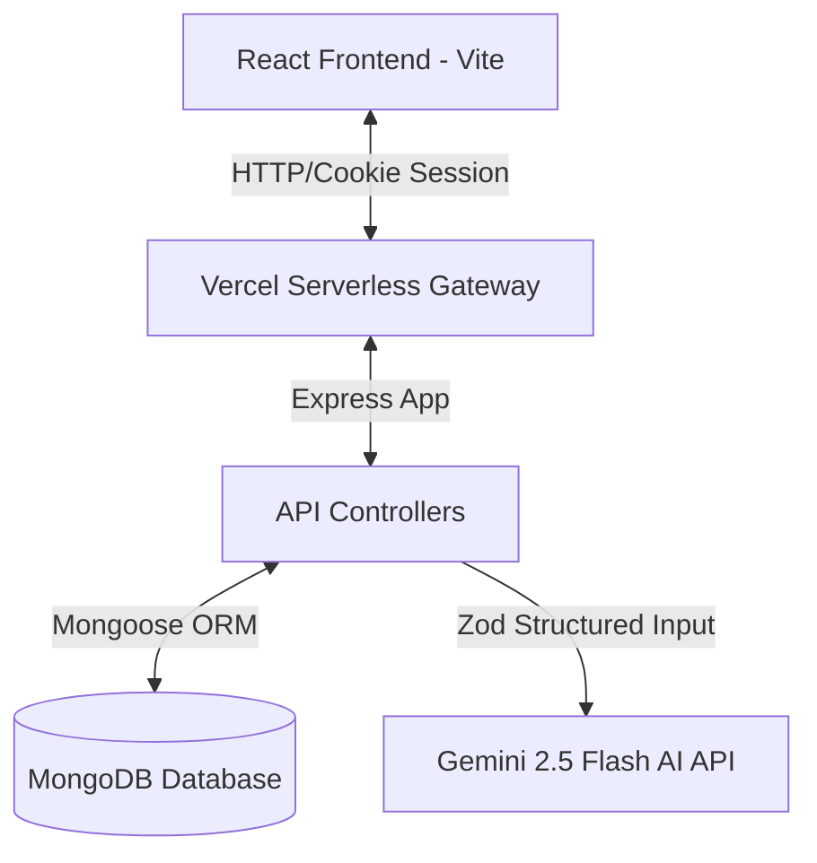

# AI Interview Preparation Platform (Monorepo)

An AI-powered interview preparation platform built to help candidates practice and succeed in job interviews. The application analyzes user resumes, self-descriptions, and target job descriptions using Google Gemini AI to generate custom, structured mock questions (technical & behavioral), localized preparation roadmaps, and tailored ATS-friendly resumes that can be downloaded locally as PDFs.

## 🚀 Key Features

* **AI Interview Roadmap Generator**: Analyzes a candidate's resume, self-description, and target job description to build a custom day-by-day preparation schedule.
* **AI Question Predictor**: Generates anticipated technical and behavioral interview questions based on the job requirements, detailing the *intention* behind each question and providing *model answers*.
* **Resume Tailoring**: Uses Gemini AI to write custom, professional, ATS-friendly resumes optimized for the specific job description.
* **Client-Side PDF Compilation**: Resolves server-side browser overhead by generating pixel-perfect, selectable vector PDF resumes directly in the client using `html2pdf.js`.
* **Visual Toast Alerts**: High-performance, glassmorphism-themed animated alerts matching the dark mode dashboard aesthetic.
* **Secure Session Authentication**: Secure user login and registration with JWT stored in HTTP-Only, Secure cookies and bcrypt password hashing.

---

## 🛠️ Technology Stack

| Layer | Technologies |
| --- | --- |
| **Frontend** | React, Vite, React Router, Context API, Axios, SASS/SCSS, `html2pdf.js` |
| **Backend** | Node.js, Express.js, MongoDB (Mongoose), JWT, Cookie-Parser, Multer |
| **AI Integration**| Google Gen AI SDK (Gemini 2.5 Flash), Zod (JSON Schema Enforcements) |
| **Hosting** | Vercel (Monorepo Serverless Configuration) |

---

## 📐 Architecture & Data Flow



### 1. Request Flow (AI Generation)
1. The frontend parses the candidate's PDF resume using `pdf-parse` (if uploaded) or reads their self-description, along with the target job details.
2. The payload is sent to `/api/interview/` (Express handler).
3. The server validates the request and invokes the `GoogleGenAI` client using `gemini-2.5-flash` with strict **Zod JSON Schema enforcements** to guarantee well-formed JSON responses.
4. The generated roadmap and questions are saved to MongoDB and returned to the client.

### 2. Resume Download Flow (Browser Engine)
1. The client requests the customized resume HTML from `/api/interview/resume/pdf/:id`.
2. The server generates the resume layout HTML tailwind-inline styles via Gemini and returns it as a JSON payload.
3. The frontend uses `html2pdf.js` to parse the HTML string in the local browser layout engine and triggers an automatic local file download (`[username]_resume.pdf`).

---

## 📁 Repository Structure

```
├── api/
│   └── index.js             # Vercel Serverless Function entrypoint (Express delegation)
├── backend/
│   ├── server.js            # Local Express development server
│   └── src/
│       ├── config/          # Database configuration (connecting to MongoDB)
│       ├── controllers/     # API request handlers (auth, interviews)
│       ├── middlewares/     # Auth cookie checks
│       ├── models/          # Mongoose database models (User, InterviewReport)
│       ├── routes/          # Express route definitions
│       └── services/        # AI Service (Gemini AI API & schemas)
├── Frontend/
│   ├── src/
│   │   ├── features/
│   │   │   ├── auth/        # Auth state context, hooks, forms
│   │   │   └── interview/   # Dashboard, roadmap renderer, custom CSS toast UI
│   │   └── style/           # SASS/SCSS styling rules
│   └── vite.config.js       # Vite build configurations
├── vercel.json              # Vercel Monorepo serverless deployment config
└── package.json             # Root monorepo dependency config
```

---

## 💻 Local Installation & Setup

### Prerequisites
* Node.js v22 or higher
* MongoDB connection string (local or MongoDB Atlas)
* Google Gemini API Key

### Setup Instructions

1. **Clone the Repository**
   ```bash
   git clone https://github.com/adiii637/AI-INTERVIEW.git
   cd AI-INTERVIEW
   ```

2. **Backend Configuration**
   Create a `.env` file in the `backend/` directory:
   ```env
   PORT=3000
   MONGO_URI=your_mongodb_connection_string
   JWT_SECRET=your_jwt_secret_key
   GOOGLE_GENAI_API_KEY=your_gemini_api_key
   ```

3. **Install Dependencies**
   From the root monorepo directory, run:
   ```bash
   # Install root dependencies
   npm install

   # Install frontend dependencies
   cd Frontend && npm install

   # Install backend dependencies
   cd ../backend && npm install
   ```

5. **Run the Application Locally**
   * **Backend**: Run `npm start` in the `backend/` directory (starts API server at `http://localhost:3000`).
   * **Frontend**: Run `npm run dev` in the `Frontend/` directory (starts Vite dev server at `http://localhost:5173`).

---

## ☁️ Deployment (Vercel)

The project is pre-configured to deploy automatically on Vercel as a monorepo.

* **Vercel Build Command**: `cd Frontend && npm install && npm run build` (configured in root `package.json`).
* **Vercel Output Directory**: `dist` (configured in `vercel.json`).
* **Vercel Functions**: Routes `/api/*` are mapped directly to the serverless Express function `api/index.js`.
